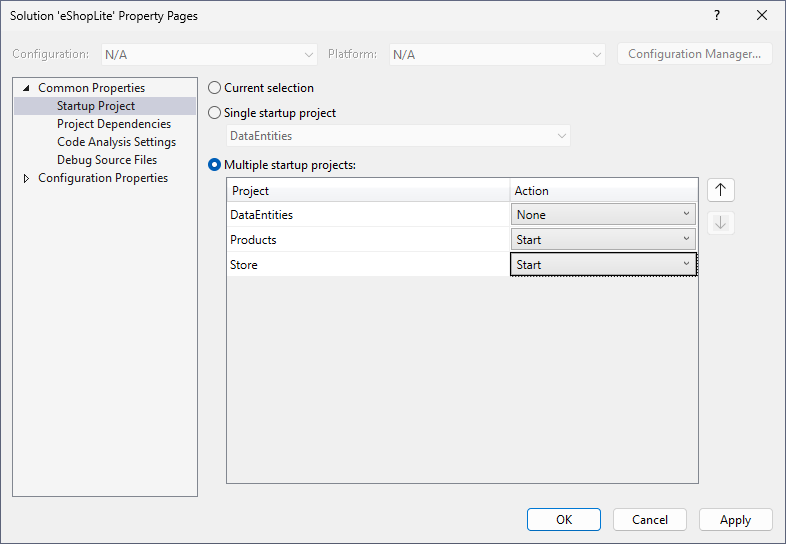
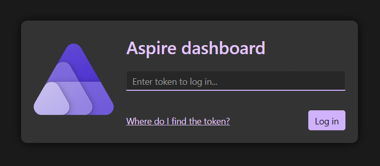

# Lab 1 - Adding .NET Aspire to an existing .NET Core application and enabling service discovery

In this lab, you will add the .NET Aspire library to an existing .NET Core application and enable service discovery. We'll be using a scaled down version of the [eShop .NET Aspire reference app](https://github.com/dotnet/eshop) called eShopLite.

## Part 1 - Running the eShopLite application

First let's run the eShopLite application to see what it looks like before adding Aspire.

1. Open Visual Studio 2022.
1. Open the **eShopLite** solution from the **Labs/Lab 1 - Add Aspire and Service Discovery** folder.
1. Right click on the solution node in Solution Explorer and select **Configure Startup Projects**. Select **Multiple startup projects** and set the **Products** and **Store** projects to **Start**. Click OK.

    

1. Press **F5** or the **Start** button to start debugging the application.
1. Two web browsers will open, one for the **Products** project and one for the **Store** project. The products browser will show a JSON representation of all the products. The store browser will show a web page, click on the **Products** link to see the products displayed.

    

1. Close the web browsers to stop debugging the applications.

The **Products** project is a backend service that provides a list of products. The **Store** project is a frontend web application that displays the products from the **Products** project. Both of these can be thought of as microservices and it's easy to imagine adding additional microservices to the application, for example a **Cart** microservice.

## What is .NET Aspire?

A cloud-native application is a web application built from small microservices, which make use of common services such as messaging queues to communicate or caches to optimize performance. Cloud-native applications are proven and widely implemented but they can be difficult to architect and build. .NET 8 includes the new .NET Aspire stack, which makes it easier to build cloud-native applications by providing service discovery, common components in NuGet packages, and simple tools for both coding and monitoring apps.

It helps solve some of the common challenges in building cloud-native applications by providing tooling for:

* Orchestration - clearly specify the projects, containers, and services that make up your application. .NET Aspire can then use service discovery to find and connect these services.
* Components - many projects need common components like data storage, caching, and messaging. .NET Aspire provides a standard interface that your application can use to access these components regardless of the underlying implementation.
* Dashboard - the .NET Aspire dashboard lets you monitor all the services that compose your application in one place. Including console logs, structured logs, traces, and metrics.

Let's add in .NET Aspire to the eShopLite application with an eye towards enabling service discovery.

## Adding .NET Aspire to the eShopLite application

1. Back in Visual Studio, right-click the **Store** project, select **Add**, and then select **.NET Aspire Orchestrator Support** and then select **Ok**.

    

1. 2 new projects will be added to the solution:
    * **eShopLite.AppHost**
    * **eShopLite.ServiceDefaults**

    > The **AppHost** and **ServiceDefaults** projects are the core of every .NET Aspire application. The **AppHost** project is the entry point and is responsible for acting as the orchestrator.
    >
    > The **ServiceDefaults** project contains the default configuration for the application. These configurations are reused across all the projects in your solution.

1. Open the **Program.cs** file from the **eShopLite.AppHost** project.
1. Notice the following line of code which adds the **Store** project the the Aspire orchestration:

    ```csharp
    builder.AddProject<Projects.Store>("store");
    ```

1. To add the **Products** project to the Aspire orchestration, right click on the **Products** project, select **Add**, and then select **.NET Aspire Orchestrator Support**.

    > A warning will appear indicating that the solution already has Aspire support. Select **Yes** to add the project to the orchestration.

Both projects are now part of the Aspire orchestration. Here's a recap of all the changes that happened, some of which were done automatically by the tooling, when adding .NET Aspire to the solution:

* An AppHost project is added. The project contains the orchestration code. It becomes the entry point for your app and is responsible for starting and stopping your app. It also manages the service discovery and connection string management.
* A ServiceDefaults project is added. The project configures OpenTelemetry, adds default health check endpoints, and enables service discovery through HttpClient.
* The solution's default startup project is changed to AppHost.
* Dependencies on the projects enrolled in orchestration are added to the AppHost project.
* The .NET Aspire Dashboard is added to your solution, which enables shortcuts to access all the project endpoints in your solution.
* The dashboard adds logs, traces, and metrics for the projects in your solution.
* In the **Store**'s Program.cs:
  * Adds a call to `AddServiceDefaults` that enables the default OpenTelemetry, meters, and service discovery.
  * Adds a call to `MapDefaultEndpoints` that enables the default endpoints, such as `/health` and `/alive`.

Now we need to make sure that the **Store** can discover the **Products** backend URL through .NET Aspire's service discovery.

## Enabling service discovery

Service discovery is a way for developers to use logical names instead of physical addresses (IP address and port) to refer to external services. So instead of having to know the IP address and port of the **Products** backend, the **Store** can refer to it by its logical name, for example `products`.

1. Open the **Program.cs** file from the **eShopLite.AppHost** project.
1. Delete the 2 lines of code that add the **Store** and **Products** projects to the Aspire orchestration:

    ```csharp
    builder.AddProject<Projects.Store>("store");
    builder.AddProject<Projects.Products>("products");
    ```

1. Add the **Products** back in, this time storing it in a variable:

    ```csharp
    var products = builder.AddProject<Projects.Products>("products");
    ```

    This is naming the **Products** project as `products` so that it can be referred to by that name from other projects in the solution.

1. Then add the **Store** to the Aspire orchestration and also include a reference to the **Products**:

    ```csharp
    builder.AddProject<Projects.Store>("store").WithReference(products);
    ```

    Now when **Store** needs to invoke **Products**, it can refer to it by the logical name `products`. In other words, the URL of the **Products** backend is now `http://products`.

1. Next update the **appSettings.json** in the **Store** project for the **ProductEndpoint** and **ProductEndpointHttps**:

    ```json
    "ProductEndpoint": "http://products",
    "ProductEndpointHttps": "https://products"
    ```

1. Press **F5** or start debugging the application.
1. The Aspire dashboard appears.

    

   > **NOTE**: You may be asked to enter an authentication token to access to the dashboard.
   > 
   > 
   > 
   > The token can be found in the terminal console. Copy and paste it to the field and click "Log in".
   > 
   > 

1. Click on the endpoint for the **store** project in the dashboard.
1. A new tab appears with the same eShopLite application, but now the **Products** backend is being called through service discovery.

---

[<- Labs](../README.md) | [Lab 2 - Add Redis caching to the app ->](/Labs/Lab%202%20-%20Caching%20and%20Dashboard/README.md)