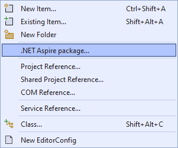
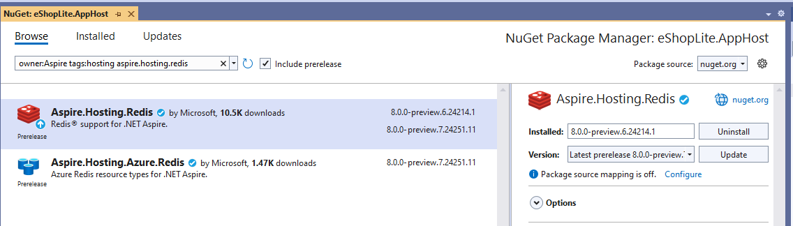
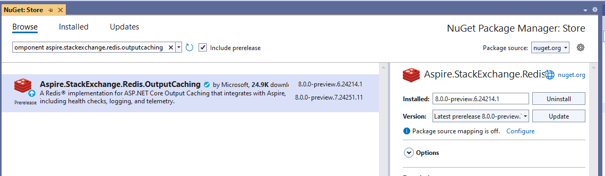
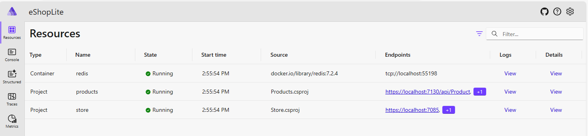
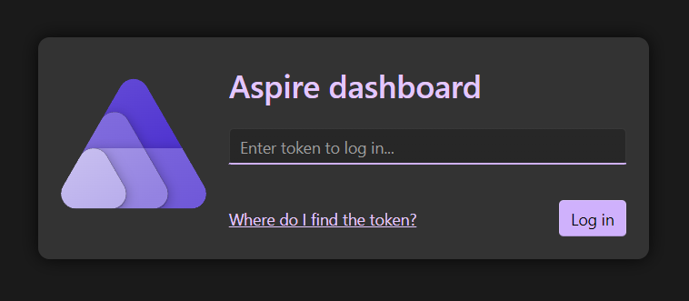
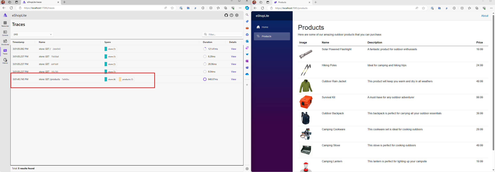
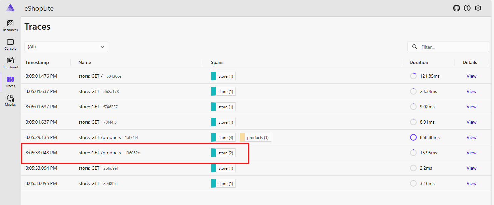
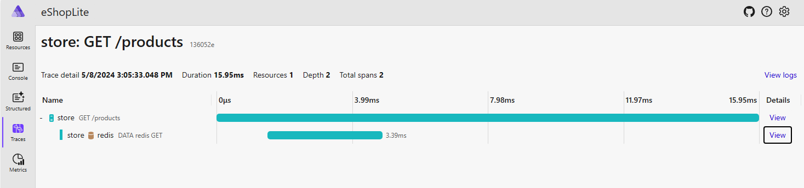

# Lab 2 - Adding caching and exploring the .NET Aspire dashboard

In this lab, you will add Redis caching to increase performance to the eShopLite application and discover how .NET Aspire makes it easy to access Redis caching services.

## Why add caching?

Caches can be used to improve the performance of many systems that take time to construct responses to their users. Consider, for example, an e-commerce web site, constructed from microservices. When a user wants to know what items are in their shopping basket, the system might:

1. Receive the request in the web app microservice.
1. Call the authentication microservice to check the users' identity if they're logged in.
1. Call the shopping basket microservice to find out what items and what quantities are in the basket.
1. Call the product catalog microservice to obtain full details of each product.
1. Call the images microservice to obtain image blobs for each product.
1. Call the stock taking microservice to check stock levels.
1. Call the shipping microservice to calculate shipping costs for the user's location and preferences.

The precise steps may differ depending on your design and business functionality but you can see that the process may be complex and involve many separate microservices and backing services. Although each microservice should be configured and resourced to perform well, the construction of the response inevitably consumes some time.

Now imagine that the user refreshes the page. Instead of reconstructing the entire HTML response from scratch, if the page or portions of it had been stored in a cache, it can be returned to the user much faster than the original request. This rapid response helps to make a web app more responsive and welcoming for users.

## Adding a Redis Cache

Redis is a popular choice for caching in a cloud-native application. In particular distributed caching allows one microservice to retrieve information stored in the cache by another microservice.

### .NET Aspire Components

We'll use .NET Apsire components to add Redis caching to the eShopLite application..NET Aspire components are a curated suite of NuGet packages specifically selected to facilitate the integration of cloud-native applications with prominent services and platforms such as Redis. .NET Aspire components handle many cloud-native concerns for you through standardized configuration patterns, such as adding health checks and telemetry.

### Adding Redis to the eShopLite application

1. Open the eShopLite solution from the Labs/Lab 2 folder. This should looks exactly like you left the solution in Lab 1.
1. Right click on the project **eShopLite.AppHost** and select  Add > .NET Aspire Package.

    

1. In the search bar, at the top left of the NuGet Package Manager, type **Aspire.Hosting.Redis**. Select the component and click the install button.

    

1. Click the **I accept** button to accept the license agreement.
1. Open the **Program.cs** file from the **eShopLite.AppHost** project.
1. Let's create a `RedisResource` object by adding the following code just after the **builder** object is created.

    ``` csharp
    var builder = DistributedApplication.CreateBuilder(args);
    
    // Create the RedisResource object
    var redis = builder.AddRedis("redis");
    ```

1. Now add another reference to the **Projects.AppHost** declaration (or the `ProjectResource` object we're creating for the store) to add the Redis reference.

    ``` csharp
    builder.AddProject<Projects.Store>("store")
        .WithReference(products)
        .WithReference(redis);
    ```

Now we have a Redis resource that we can use in our application. Let's add a cache to the store website.

1. Right click on the project **Store** and select  Add > .NET Aspire Package.
1. In the search bar, at the top left of the NuGet Package Manager, type **Aspire.StackExchange.Redis.OutputCache**. Select the component and click the install button.

    

1. Click the **I accept** button to accept the license agreement.
1. Open the **Program.cs** file from the **Store** project.
1. Just after the `builder` is created, add the following code to add the Redis Output Cache.

    ``` csharp
    builder.AddRedisOutputCache("redis");
    ```

    Notice how we're referring to the redis cache as `"redis"`, the same name we gave it when we created the `RedisResource` object in the **Program.cs** file of the **eShopLite.AppHost** project.

1. Now to add the caching middleware to the request pipeline add the following code just after the `app` is created.

    ``` csharp
    app.UseOutputCache();
    ```

1. To cache the products list, open the **Products.razor** file from the **Components > Pages** folder. Add the following code to the top of the file, after the last `@attribute` command.

    ``` csharp
    @attribute [Microsoft.AspNetCore.OutputCaching.OutputCache(Duration = 10)]
    ```

Now, when you run the application, the products list will be cached for 10 seconds. You can change the duration to see the effect of the cache. The first time you access the page, the products list will be retrieved from the database. The next time you access the page within the cache duration, the products list will be retrieved from the cache.

## Explore the .NET Aspire dashboard

The .NET Aspire dashboard allows you to closely track various aspects of your app, including logs, traces, and environment configurations, in real-time. It's purpose-built to enhance the local development experience, providing an insightful overview of your app's state and structure.

Let's see the effect of our caching implementation in the .NET Aspire dashboard.

1. In Visual Studio, to start the app, press `F5` or **select Debug > Start Debugging**.
    > If Docker is not running, you will either be prompted to start it or receive an exception indicating that it needs to be started.
1. When the .NET Aspire dashboard appears, note the you have now three resources: **store**, **products**, and **redis**. Redis is Type is **Container**.

    

   > **NOTE**: You may be asked to enter an authentication token to access to the dashboard.
   > 
   > 
   > 
   > The token can be found in the terminal console. Copy and paste it to the field and click "Log in".
   > 
   > 

1. Click on the store the endpoints, a new tab will open with the store website.
1. For the next few steps it will be easier to visualize the impact of the cache, to have the store website and the .NET Aspire dashboard side by side.
1. In the .NET Aspire dashboard, click on **Traces** from the left menu. This display the traces of the requests made to the store website through the different resources.

    

1. In the store website, click on the **Products** link. This will display the products list.
1. Note that in the .NET Aspire dashboard, new lines were added. Note that in the **Spans** column, some are identified as **store** and one with **store: GET /products** as name has **store** and **products**. This is because the first time the products list was retrieved from the database (aka products).

    

1. Now refresh the store website displaying the product list.
1. Looking back at the .NET Aspire dashboard, new lines were added, but this time the **Spans** column for the line **store: GET /products** has only **store**. This is because the products list was retrieved from the cache.

    

1. Click on the **View** link in the column details of the line **store: GET /products**. This will display the details of the request.
1. Note that the detail line **DATA redis GET**. This is where the cache was used instead of the database.

    

1. Try a few more time with-in or out the 10 second limit that was set in the **Products.razor** page.

---

[<- Lab 1 - Add Aspire and Service Discovery to an existing app](/Labs/Lab%201%20-%20Add%20Aspire%20and%20Service%20Discovery/README.md) | [Lab 3 - Deploy to Azure Container Apps ->](/Labs/Lab%203%20-%20Deploy/README.md)
