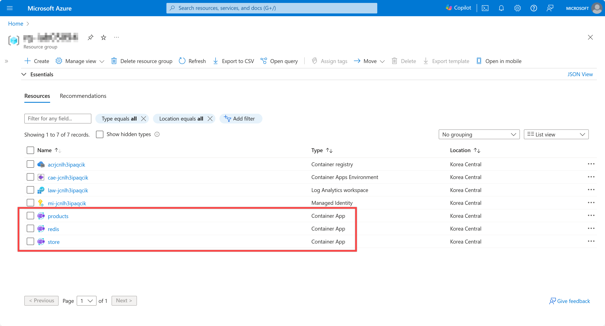
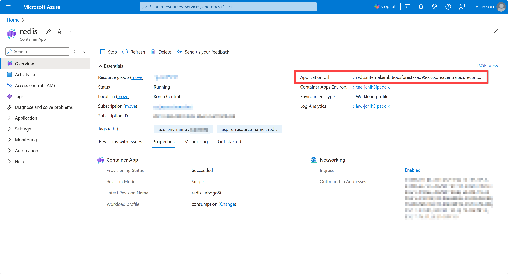

# Lab 3 - Deploy the and provision the entire application to Azure

In this lab, you will deploy the entire application to Azure Container Apps (ACA) using the Azure Developer CLI (`azd`).

`azd` is a command line interface tool that helps developers provision resources in and deploy applications to Azure. It provides best practices and developer-friendly commands that map to key stages in the development lifecycle. It provisions Azure resources via Bicep files and can deploy .NET applications to various PaaS services such as Azure Container Apps, Azure Functions, and Azure App Service.

## Expose the store app to the Internet

Before deploying the application, we'll need to update some code to make sure it the app is exposed to the public Internet.

You'll need to add the `WithExternalHttpEndpoints` method to the store project to do so.

1. Open the eShopLite solution from the **Labs/Lab 3** directory. This should looks exactly like you left the solution in Lab 2. Or you can continue working with the solution you have been before.
1. Open the **eShopLite.AppHost\Program.cs** file and find the following line:

    ```csharp
    builder.AddProject<Projects.Store>("store")
        .WithReference(products)
        .WithReference(redis);
    ```

1. Add `.WithExternalHttpEndpoints()` right above the `.WithReference(products)` line:

    ```csharp
    builder.AddProject<Projects.Store>("store")
        // Add this line 👇
        .WithExternalHttpEndpoints()
        // Add this line 👆
        .WithReference(products)
        .WithReference(redis);
    ```

    This will make sure the store app is exposed to the public Internet. Now we can get ready to create our Azure resources and deploy the application.

## Update or install the Azure Developer CLI

First you'll need to be sure to have the latest version of the Azure Developer CLI installed. You can use winget to do that.

If you already have the Azure Developer CLI installed, you can upgrade it using winget:

```powershell
winget upgrade Microsoft.Azd
```

If you don't already have the Azure Developer CLI installed, you can install it using winget:

```powershell
winget install Microsoft.Azd
```

## Login to Azure

1. Open a terminal and run the following command to login to Azure:

    ```powershell
    azd auth login
    ```

## Initialize the deployment environment

1. Make sure your terminal is in a directory that contains the **eShopLite.sln** file. Whether it's the directory you've been making all the changes in, or **Labs\Lab 3 - Deploy**, you need to be at the same level as the solution file.
1. Run the following command to initialize the deployment environment:

    ```powershell
    azd init
    ```

1. The Azure Developer CLI will prompt you with several questions. Answer them as follows:

   - `? How do you want to initialize your app?`
     - `> Use code in the current directory`
   - `? Select an option`
     - `> Confirm and continue initializing my app`
   - `? Enter a new environment name`
     - `<RANDOM_NAME>`

   > **Note**:
   >
   > Replace `<RANDOM_NAME>` with your preferred environment name. Use something that will be easy to remember and distinct in your environment. If you're running this in the Build lab, you could use your initials followed by "lab" followed by the time. For example, `ms-lab-1330`.

1. Now go back to the directory and confirm the following files have been generated:

   - `.azure/.gitignore`
   - `.azure/config.json`
   - `.azure/<RANDOM_NAME>/.env`
   - `.azure/<RANDOM_NAME>/config.json`
   - `azure.yaml`
   - `next-steps.md`

    If those files and directories exist, you've successfully initialized the deployment environment. Now we're ready to provision and deploy the application into Azure.

## Provision and deploy the application

1. Run the following command to provision and deploy the application to Azure Container Apps:

    ```powershell
    azd up
    ```

1. Again, azd will prompt you with several questions. Answer them as follows:

   - `? Select an Azure Subscription to use:`
     - `> <AZURE_SUBSCRIPTION>`
   - `? Select an Azure location to use:`
     - `> <AZURE_LOCATION>`

   > **Note**:
   >
   > If you have only one Azure subscription, it will be automatically chosen.
   >
   > Replace `<AZURE_SUBSCRIPTION>` and `<AZURE_LOCATION>` with your Azure subscription and location.

1. Now azd will provision the Azure resources your application need and deploy your app to those resources. All from a single command! Wait for the deployment to complete. It may take a few minutes.
1. Once the deployment is over, go to the Azure Portal and navigate to the resource group of `rg-<RANDOM_NAME>` and find the Azure Container Apps instances.

   

1. Click the Container Apps instance, **redis**, and notice that the **Application Url** value has the word **internal** in it. This indicates the resource is NOT exposed to the Internet.

   

1. Click the Container Apps instance, **products**, again notice the word **internal** in the **Application Url** value.

   

1. Click the Container Apps instance, **store**, and note that **Application Url** does not contain the word **internal**. The store website is available to the Internet.

   

> **Note**:
>
> At this point, the store app is available but there isn't any database. Trying to navigate to the product page will result in an error. We'll add a database in the next lab.

## Analyze the provisioning

That might have seemed like magic, but we can have azd explain what it did by creating Bicep files for the resources it provisioned. This way we could put those infrastructure files in source control.

1. Switch back to the terminal.
1. Then you can generate the Bicep files by running the following commands:

    ```powershell
    azd config set alpha.infraSynth on
    azd infra synth
    ```

1. Confirm the following files have been generated:

   - `infra/main.bicep`
   - `infra/main.parameters.json`
   - `infra/resources.bicep`

1. Open those files and see which resources are being provisioned.

## Analyze the deployment

When using azd outside of .NET Aspire, you have to specify which applications you want to deploy. But azd automatically detects the applications for you with .NET Aspire-based projects. You can still see what azd is deploying by generating a manifest file.

1. From the terminal run:

    ```bash
    dotnet run --project eShopLite.AppHost/eShopLite.AppHost.csproj `
        -- `
        --publisher manifest `
        --output-path ../aspire-manifest.json
    ```

1. Confirm the following file has been generated:

   - `aspire-manifest.json`

1. Open the `aspire-manifest.json` file and see which resources are being deployed.

1. To delete all the resources created by the deployment, you can execute the following command:

    ```powershell
    azd down
    ```

---

[<- Lab 2 - Add Redis caching to the app](/Labs/Lab%202%20-%20Caching%20and%20Dashboard/README.md) | [Lab 4 - Add a database to the app ->](/Labs/Lab%204%20-%20Data/README.md)
