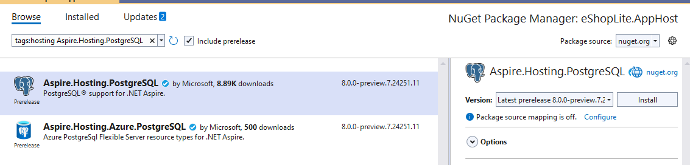
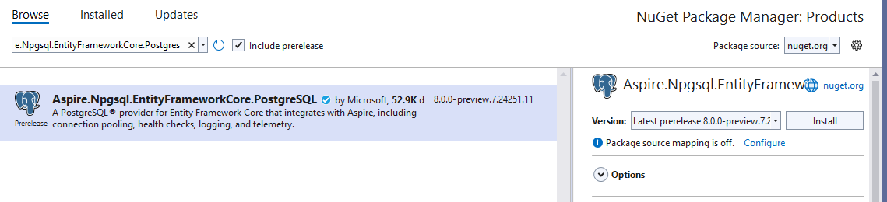
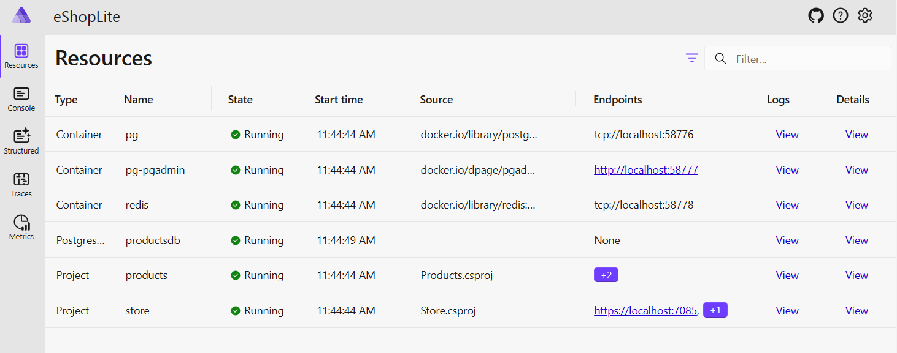
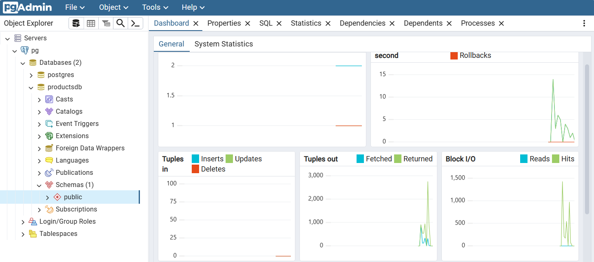
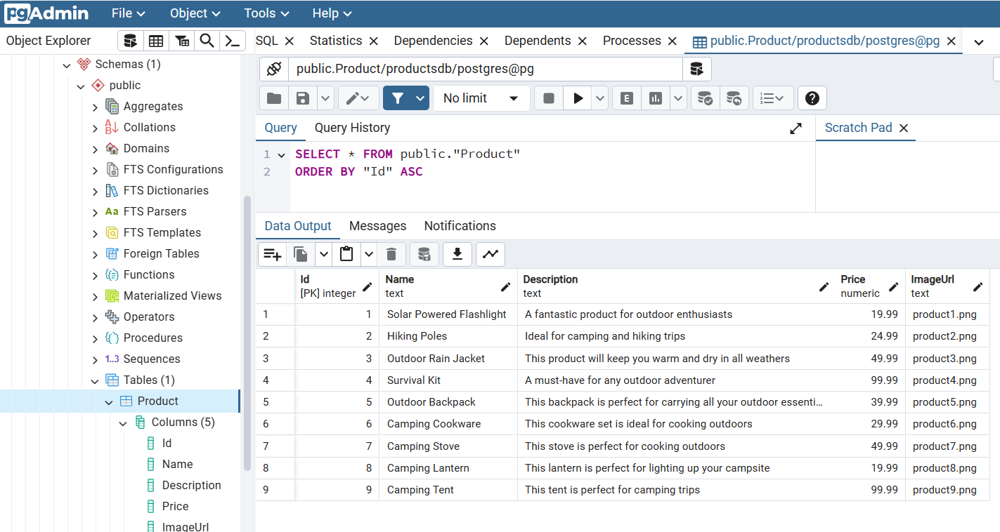

# Lab 4 - Add data access and persistence

.NET Aspire makes it very easy to add a database to your applications. Many SQL-compliant database are already available as .NET Aspire components. In this lab, you will add postgreSQL (or mysql). (This will be optional during the in-person portion of the workshop at Build.)

## Adding a PostgreSQL database

1. Open the eShopLite solution from the Labs/Lab 4. This should looks exactly like you left the solution in Lab 3. Or you can continue working with the solution you have been before.
1. Right click on the project **eShopLite.AppHost** and select  **Add > .NET Aspire Package.**
1. In the search bar, at the top left of the Nuget Package Manager, type **Aspire.Hosting.PostgreSQL**. Select the component and click the install button.

    

1. Open the **Program.cs** file from the **eShopLite.AppHost** project.
1. Let's create a database and passes it to the product API by updating the code. Here save the resource in the variable `productsdb`, and pass it to the `products` using the `WithReference` method.

    ```csharp
    var productsdb = builder.AddPostgres("pg")
                            .AddDatabase("productsdb");

    var products = builder.AddProject<Projects.Products>("products")
        .WithReference(productsdb);
    ```

1. Some of the .NET Aspire database components also allow you to create a container for database management tools. To add **PgAdmin** to your solution to manage the PostgreSQL database, use this code:

    ``` csharp
    var productsdb = builder.AddPostgres("pg")
                            .WithPgAdmin()
                            .AddDatabase("productsdb");
    ```

The advantage of letting .NET Aspire create the container is that you don't need to do any configuration to connect PgAdmin to the PostgreSQL database, it's all automatic.

## Configure Product API to use a PostgreSQL database

1. Right click on the project **Product** and select  **Add > .NET Aspire Package**.
1. In the search bar, at the top left of the Nuget Package Manager, type **Aspire.Npgsql.EntityFrameworkCore.PostgreSQL**. Select the component and click the install button. We are using this one because the solution uses Entity Framework; otherwise the component **Aspire.Npgsql** would be used.

    

1. Click the **I accept** button to accept the license agreement.
1. Open the file **appsettings.json** and remove the `ConnectionStrings` section completely. It should look like this with it removed:

    ``` json
    {
        "Logging": {
            "LogLevel": {
                "Default": "Information",
                "Microsoft.AspNetCore": "Warning"
            }
        },
        "AllowedHosts": "*"
    }
    ```

1. Open the **Program.cs** and remove the entire command that starts with `builder.Services.AddDbContext<ProductDataContext>(options....`.
1. Where the previous command was, add the following code to add the Context from the database declared in the eShopLite.AppHost project using the same string "productsdb".

    ``` csharp
    builder.AddNpgsqlDbContext<ProductDataContext>("productsdb");
    ```

## Explore the .NET Aspire dashboard

Let's test it:

1. In Visual Studio, to start the app, press `F5` or **select Debug > Start Debugging**.

    > If Docker is not running, you will be prompted to start it.

1. When the .NET Aspire dashboard appears, note the you have many more resources.

    

   > **NOTE**: You may be asked to enter an authentication token to access to the dashboard.
   > 
   > 
   > 
   > The token can be found in the terminal console. Copy and paste it to the field and click "Log in".
   > 
   > 

1. Click on the **pg-pgadmin** resource, a new tab will open with the pgAdmin website. It can takes a few seconds to completely load.
1. From the pgAdmin website, you manage the products database. To visualize the products table, expand the **Aspire instances** node, then **pg > Databases > productsdb > Schemas > Tables**.

    

1. You can see all the rows by right-clicking on the **products** table and selecting **View/Edit Data > All Rows**.

    

1. Now going back the the .NET Aspire dashboard, click on **store** the endpoints, a new tab will open with the store website.
1. The store works like before but now uses a PostgreSQL database in a container.

## Deploy / Re-deploy the solution with a PostgreSQL database

1. If you you are in a folder from where the solution was never deployed, `azd init` then `azd up` will deploy the solution without any problem.

   If you are in the same folder where the solution was previously deployed, then just run `azd up` to deploy the updated application including the PostgreSQL database.

1. Wait for the deployment to complete. It should be faster than the first time because most of the resources are already created.
1. Once the deployment is over, click on the link `store` from the `(azd deploy)` outputs, or go to the Azure Portal and navigate to the resource group of `rg-<RANDOM_NAME>` and find the Azure Container Apps named **store**.
1. The store should be working as before, but now it uses a PostgreSQL database.

### Clean up

To delete all the resources created by the deployment, in Lab 3, you can execute the following command:

```powershell
azd down
```

---

[<- Lab 3 - Deploy to Azure Container Apps](/Labs/Lab%203%20-%20Deploy/README.md) | [Final Solution ->](../Lab%20Final%20Solution/)
